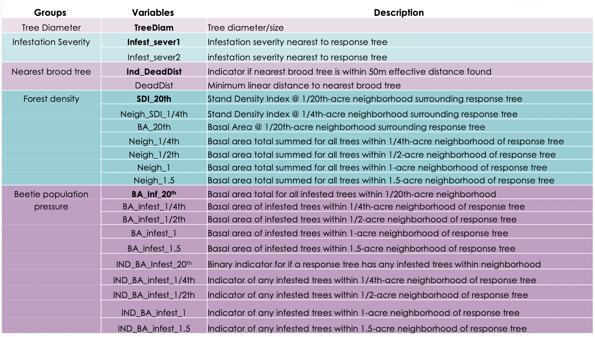

```{r setup, include=FALSE}
library(flexdashboard)
library(tidyverse)
library(readxl)
library(GGally) # ggpairs
library(vip)
library(tidymodels)
```

Read Me
==============================================================================

Row {data-height=700}
-----------------------------------------------------------------------

### What are Pine Beetles? And Why Are You Reading This?

__*Read me before proceeding to the analysis!*__

Pine Beetles are insects that can cause devastation to forests by eating into tree bark and upsetting the flow of water and nutrients to infected trees. Pine Beetles cause economic and ecological harm, so it's important to figure out how to protect forests from them.
<br>
</br>
There are five categories of variables shown on the Variable Chart page, which is accessed through the tabs at the top of this page: Tree diameter, infestation severity, nearest brood tree, forest density, and beetle population pressure.
<br>
</br>
Knowing how these variables relate to each other can help foresters figure out how to protect forests. For example, in this analysis, I will make two models for predicting the minimum linear distance to the nearest brood tree, or DeadDist. In other words, how far away from an infected tree can a given healthy tree be to be considered "safe"? This is important for foresters so that they don't clear trees unnecessarily and know when to expect tree death.

### Relevant habits that might be relevant to our analysis

* Female Pine Beetles use pheromones to attract other Pine Beetles nearby when they are ready to lay eggs<sup>1</sup>
  + Pine Beetles will tend to attack as a group and infected trees will cause more infection around them
<br>
</br>
* Pine Beetles infestations in forests are usually directional<sup>1</sup>
<br>
</br>
* Most Pine Beetles like attacking bigger trees (>10in), but when there is a lot of competition for trees, they will attack smaller trees<sup>2</sup>
  + May be wise to include TreeDiam as a variable!
<br>
</br>
* Pine Beetles usually fly 300 feet or less at a time
  + 300 feet = ~.007 acres, which means that we will probably not want to use any of the beetle population pressure measures of over the smallest variable measure (1/20 acres = .05 acres)<sup>2</sup>


Row {data-height=200}
-----------------------------------------------------------------------

### Sources
1. [Basic Pine Beetle info](https://www.treefarmsystem.org/SPBwhenbeetlesattack)
2. [Pine Beetle FAQ USDA](https://www.fs.usda.gov/Internet/FSE_DOCUMENTS/stelprdb5304956.pdf)
3. [Stand Density Index info](https://fennerschool-associated.anu.edu.au/mensuration/density.html)

Data Exploration
==============================================================================

Row {data-height=300}
-----------------------------------------------------------------------

### Data Table

```{r readindata}
pine_tbl <- read_excel("../../hgen-612_temp/p1/data/Data_1993.xlsx", sheet = 1)
```

```{r makeshowcasebones}
glimpse(pine_tbl) # correlation matrix or ggpairs, make a table
```

```{r ggpairs}
# correlation matrix or ggpairs, make a table
```

Row {data-height=450}
-----------------------------------------------------------------------

### GGPairs

```{r ggpairs}
```

### Things to Note


Look at patterns, outliers, anything surprising, reasons for choosing certain 
variables in the recipe, things that are not normally distributed, etc. 

Modelling Strategy
==============================================================================

Row {data-height=350}
-----------------------------------------------------------------------

### Predictors

```{r}

```

### Explanation of code

```{r}

```

Conclusion
==============================================================================

### Model Results

```{r}

```

### ROC AUC

```{r}

```

Variable Chart
==============================================================================

### Picture of variables


